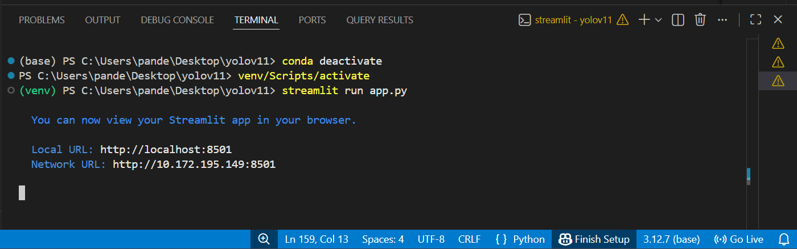
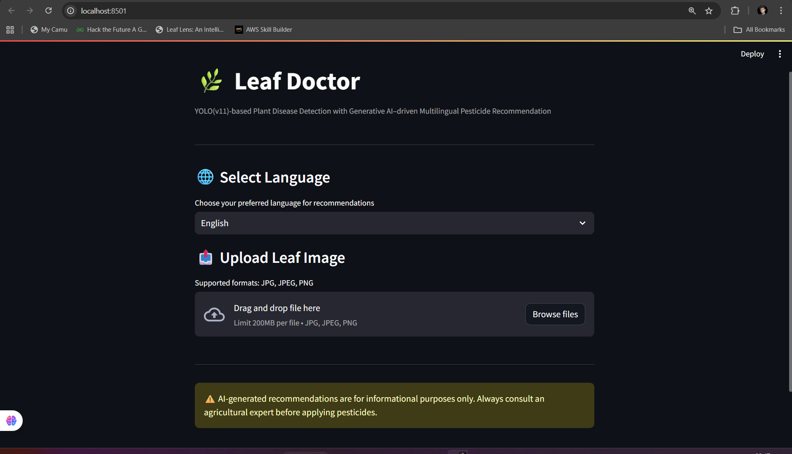
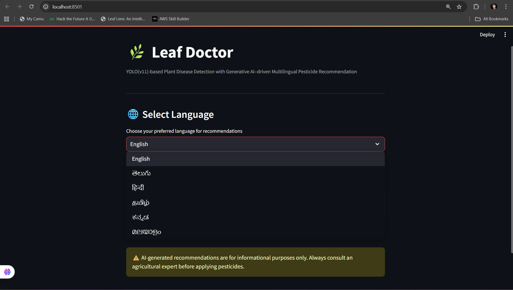
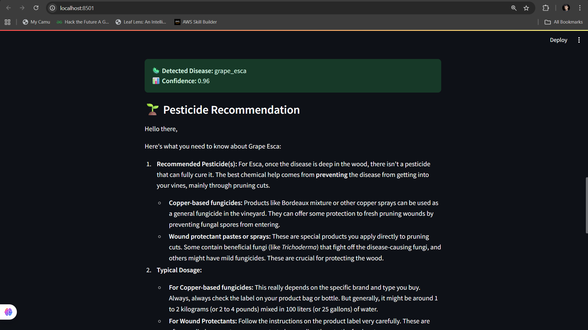

# 🌿 Leaf Doctor  
**YOLO-Based Plant Leaf Disease Detection with Gen-AI Driven Multilingual Pesticide Recommendation**

---

## 1. Problem Statement

Plant diseases significantly reduce crop yield and quality, directly impacting farmers’ income and food security.  
Traditional disease identification relies on manual inspection by experts, which is time-consuming, subjective, and often inaccessible to small-scale farmers. Delayed or incorrect diagnosis leads to improper pesticide usage, increased costs, and environmental harm.

---

## 2. What This Project Solves

This project provides an **end-to-end automated system** that:
- Detects plant leaf diseases from images with high accuracy
- Localizes infected regions using bounding boxes
- Generates **language-specific pesticide recommendations**
- Adds **Generative AI–based advisory support** with safety caution

The system bridges the gap between **computer vision-based detection** and **actionable agricultural guidance**.

---

## 3. Why Existing Methods Are Insufficient

Traditional approaches such as:
- Rule-based image processing
- Classical machine learning with handcrafted features
- CNN-based classification without localization

have the following limitations:
- No precise localization of infected regions
- Poor generalization under varying lighting and backgrounds
- Limited interpretability for end users
- No integrated advisory or recommendation system

In contrast, this project leverages **YOLOv11**, which performs **real-time detection and classification**, combined with **Generative AI**, making the solution more accurate, explainable, and user-friendly.

---

## 4. Project Workflow Overview

The complete workflow of the system is as follows:
1. User runs the application via terminal
2. Web interface launches using Streamlit
3. User selects preferred language
4. Leaf image is uploaded
5. YOLOv11 detects disease and confidence score
6. Generative AI produces pesticide recommendations
7. Safety caution is displayed for responsible usage

---

## 5. Running the Application (Terminal)

The application is executed using a virtual environment and Streamlit.

```bash
venv\Scripts\activate
streamlit run app.py
```
Terminal Execution



---

## 6. User Interface Overview

The system provides a simple, intuitive, and farmer-friendly web interface that allows users to interact with the model without technical complexity.



---

## 7. Language Selection

Users can choose their preferred language for pesticide recommendations, enabling accessibility across different regions and user groups.

Supported languages:
- English
- Telugu
- Hindi
- Tamil
- Kannada
- Malayalam



---

## 8. Leaf Image Upload

Users upload a plant leaf image in JPG or PNG format. The system supports real-world images captured using mobile devices or cameras.


---

## 9. Disease Detection Result and Confidence

The YOLOv11 model detects the disease, highlights the infected region using a bounding box, and displays the predicted disease class along with the confidence score.


---

## 10. Pesticide Recommendation (Gen-AI Powered)

Based on the detected disease, a Generative AI model (Gemini API) provides:
- Disease-specific pesticide suggestions
- Preventive and control measures
- Clear, human-readable explanations
- Output in the selected language



---

## 11. Generative AI Caution

The system explicitly informs users that AI-generated recommendations are advisory and must be verified by agricultural experts.


> AI-generated pesticide recommendations are for informational purposes only.  
> Always consult a certified agricultural expert before applying any pesticide.

---

## 12. Technology Stack

- YOLOv11 – Object detection and disease localization  
- PyTorch – Deep learning framework  
- Streamlit – Web application interface  
- Google Gemini API – Generative AI for recommendations  
- Python – Backend logic and integration  

---

## 13. API Key Requirement (Important)

To enable Generative AI-based pesticide recommendations, users must generate their own Gemini API key from:

https://makersuite.google.com/app/apikey

Add the API key in `app.py` or set it as an environment variable:

```python
GEMINI_API_KEY = "PASTE_YOUR_OWN_GEMINI_API_KEY_HERE"
```
Do not upload your API key to GitHub.

## 14. Conclusion

This project demonstrates how modern object detection models combined with Generative AI can create a practical, real-world agricultural decision support system.
The solution improves accuracy, accessibility, and usability compared to traditional plant disease detection approaches, making it suitable for real-time deployment and future scalability.

## Author

**Mohan Sai Pandeti**  
B.Tech – Computer Science and Engineering (Data Science)  
IEEE Student Member  

🔗 LinkedIn: https://www.linkedin.com/in/mohansaipandeti/

